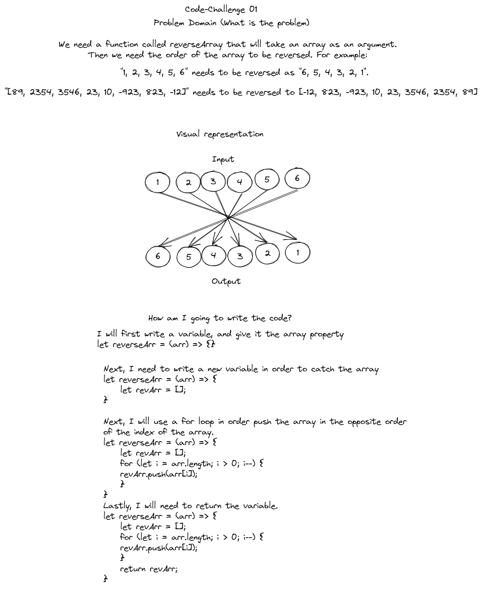
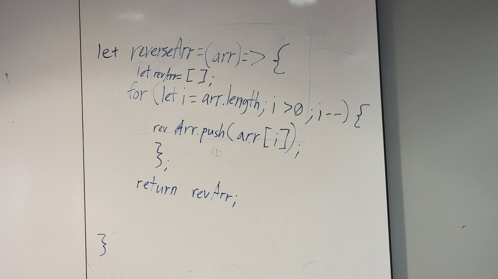

# Reverse an Array
The challenge was to start with

## Whiteboard Process

## Approach & Efficiency
How I apporached this is how I always apporach pretty much anything in life. I read, understand as much as I can, and then ask questions to what I don't understand. Then I just wrote the problem in English, and then translated in JavaScript.

##Contributions
Jordan Yamada - Helped with understanding the assignment by explaining what the Challenge meant with the following wording "Without utilizing any of the built-in methods available to your language, return an array with elements in reversed order." So Jordan, Jeffrey and I did a white board together, because I wanted to make sure that I fully understood the assignment.
Shane Roach - Helped me with organizing my directories and files.

