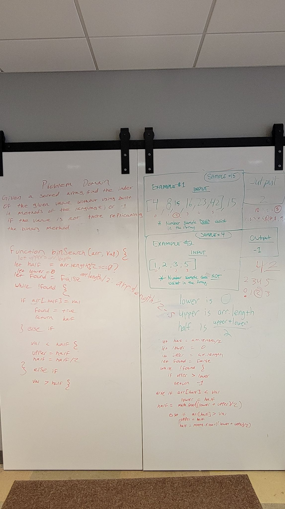
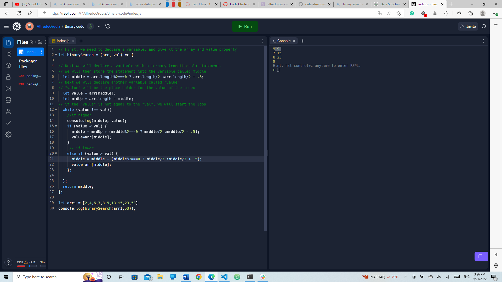

# Binary Search of Sorted Array
Write a function called BinarySearch which takes in 2 parameters: a sorted array and the search key. Without utilizing any of the built-in methods available to your language, return the index of the array’s element that is equal to the value of the search key, or -1 if the element is not in the array.

## Whiteboard Process

## Approach & Efficiency
How we approached it was ina group. Jeffrey and I found a psudo code online accidentally while looking for definition of binary code. We then started writing the logic of the code as shown in the image.

## Contributions
Jordan Yamada - Jeffrey Smith, David Tusia - Carlos Herrera - Rhea Carillo - Amy Pierce. It was a collaborative problem solving what we did. We all got together again and worked together to solve it.
