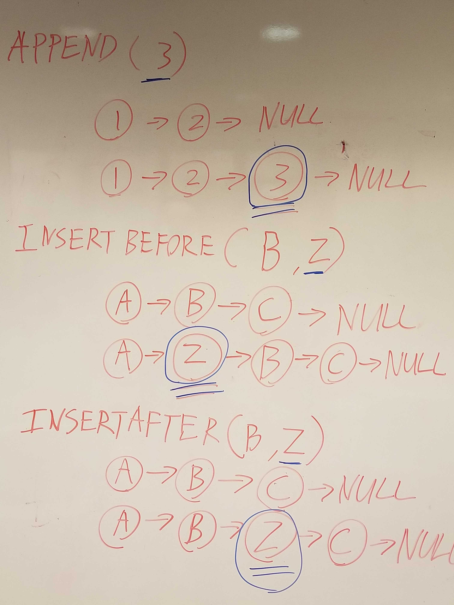

## Summary
We need to append arguements and new values. Then it needs to add a new node with the given value to the end of the list.
The code also needs to insert the arguments value, and the new value before the array.

## Solution
Test - npm test LinkedList.test.js

## Image

## Contributions
Shout out to Jordan Yamada and Jeffrey Smith

