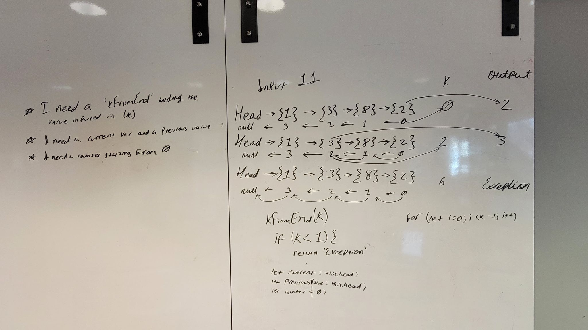

# Challenge Summary
What we want to hapen is whenever we submit a value, we want to return the value that is provided by the index, as shown on the white board.

## Whiteboard Process

## Approach & Efficiency
I know that I needed an if statement, so I started writting a for loop with the if statements.

## Contributions
I would like to bring contributions to Jordan Yamada and Jeffrey Smith.
