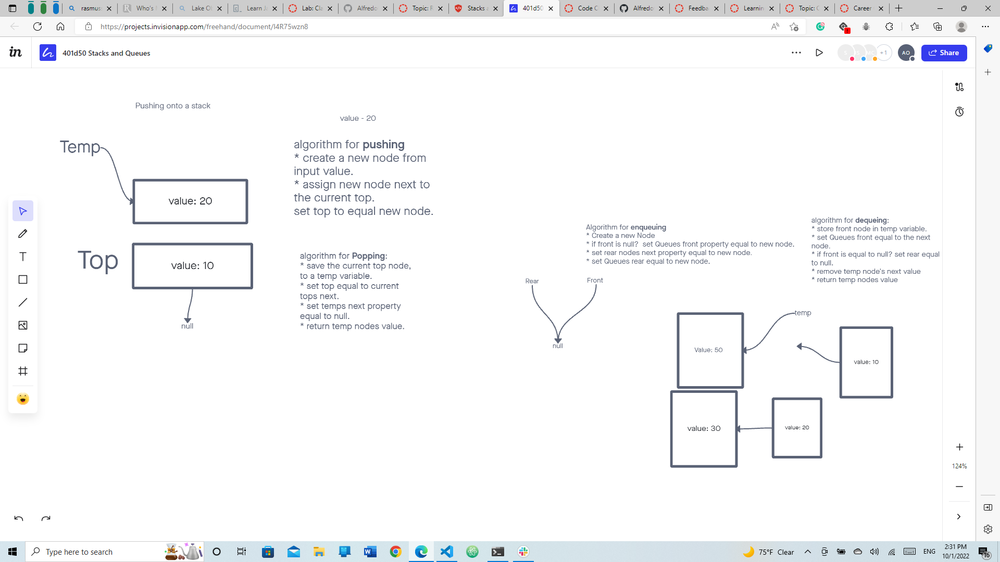
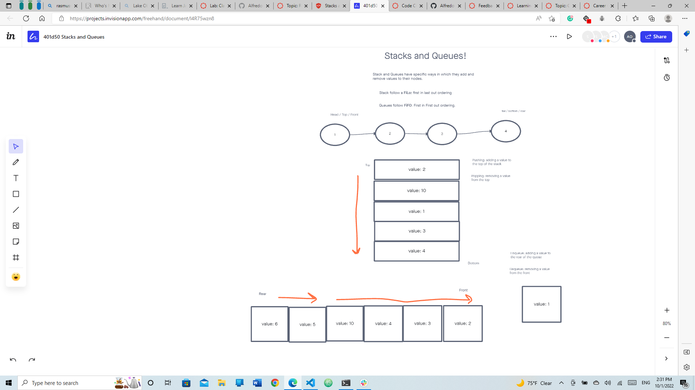

# Stacks and Queues

## Challenge
Using a Linked List as the underlying data storage mechanism, implement both a Stack and a Queue
Create a Stack class that has a top property. It creates an empty Stack when instantiated.
Create a Queue class that has a front property. It creates an empty Queue when instantiated.

## Whiteboard

## Approach & Efficiency
I used trial and error, console logs, bing, google, stack overflow, and TA's.

## Collaborations
Jeffrey Smith, Jordan Yamada, and Shane Roach
