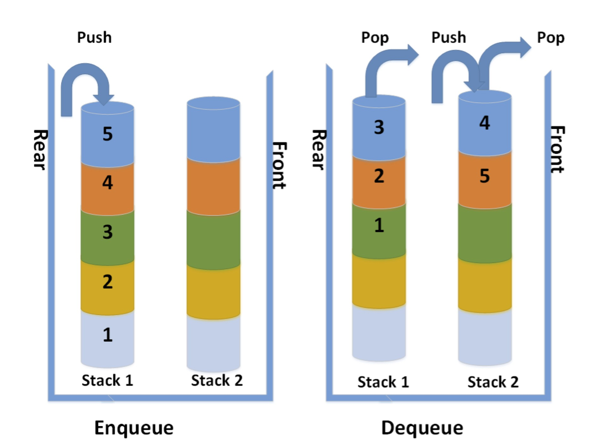

# Animal Shelter

## Challenge
Create a class called AnimalShelter which holds only dogs and cats.
The shelter operates using a first-in, first-out approach.

## Documentation

## Approach and efficiency
Just took some code from other challenges with the Queues, and used Stack overflow, google, and bing for some hiccups that I was facing.

## Test
[Test](animal-shelter.test.js)

## Collaborations
Jordan Yamada and Jeffrey Smith
