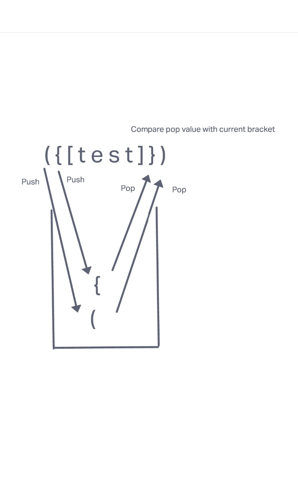

# Stacks and Queues Brackets

## Challenge
Write a function called validate brackets
Arguments: string
Return: boolean
representing whether or not the brackets in the string are balanced
There are 3 types of brackets:

Round Brackets : ()
Square Brackets : []
Curly Brackets : {}

## Documentation

## Approach & Efficiency
I used trial and error, console logs, bing, google, stack overflow, and TA's.

## Collaborations
Jeffrey Smith, Jordan Yamada, and Shane Roach
