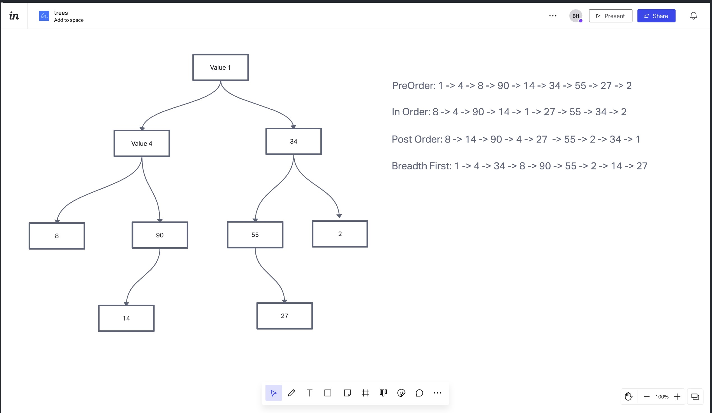

# Trees-Max

## Challenge
Write the following method for the Binary Tree class

find maximum value
Arguments: none
Returns: number
Find the maximum value stored in the tree. You can assume that the values stored in the Binary Tree will be numeric.

## Approach & Efficiency
Trial and error, used the TA's. Also, used the starter code, and copied (or used as a reference) the previous challenge

## API
Use npm test code-challenge-16 to use the test

## Documentation

## Collaborations
Jeffrey Smith, Jordan Yamada, Shane Roach, and Michael Treats
