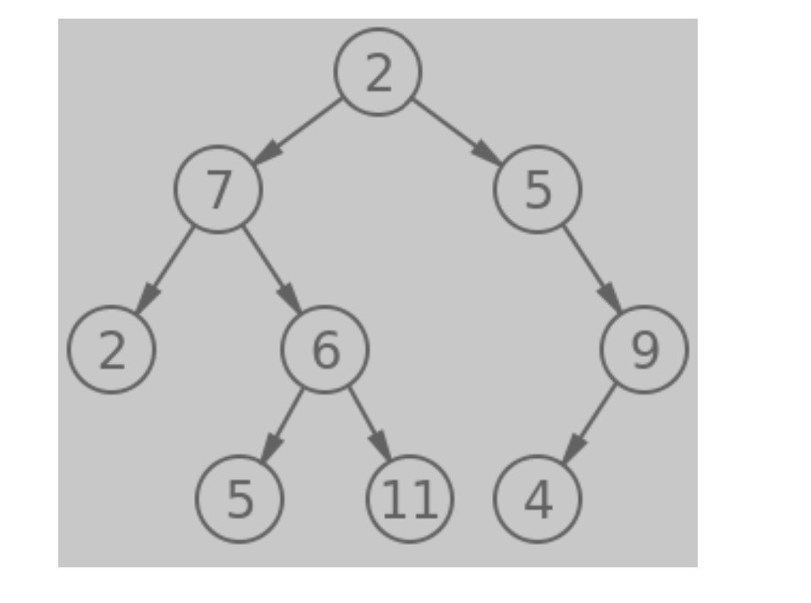

# Trees-Max

## Challenge
Write a function called breadth first
Arguments: tree
Return: list of all values in the tree, in the order they were encountered

## Approach & Efficiency
Trial and error, used the TA's. Also, used the starter code, and copied (or used as a reference) the previous challenge

## API
Use npm test code-challenge-17 to use the test

## Documentation

## Collaborations
Jeffrey Smith, Jordan Yamada, Shane Roach, and Michael Treats
