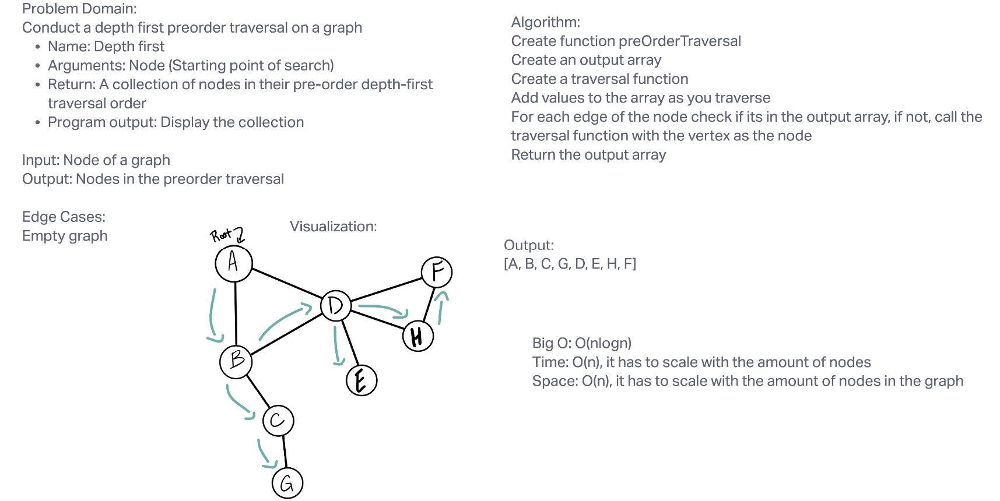

# Graph breadth first

## Challenge
Utilize the Single-responsibility principle: any methods you write should be clean, reusable, abstract component parts to the whole challenge. You will be given feedback and marked down if you attempt to define a large, complex algorithm in one function definition.

Write at least three test assertions for each method that you define.

Ensure your tests are passing before you submit your solution.
## Test
to run the test, type in "npm test code-challenge-36"

## Approach & Efficiency
Console logs, bing, stackoverflow, reading Jeffreys code, as well as Brookes.

## UML

