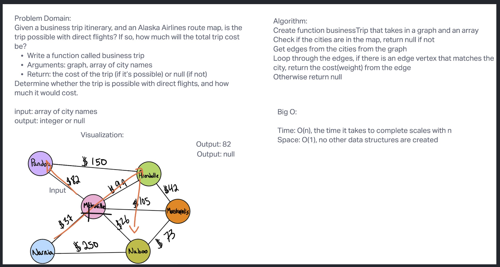

# Graph business trip

## Challenge
Write a function called business trip
Arguments: graph, array of city names
Return: the cost of the trip (if it’s possible) or null (if not)
Determine whether the trip is possible with direct flights, and how much it would cost.

## Test
to run the test, type in "npm test code-challenge-37"

## Approach & Efficiency
Console logs, bing, stackoverflow, reading Jeffreys code, as well as Brookes.

## UML

## Contributions
Jeffrey Smith
