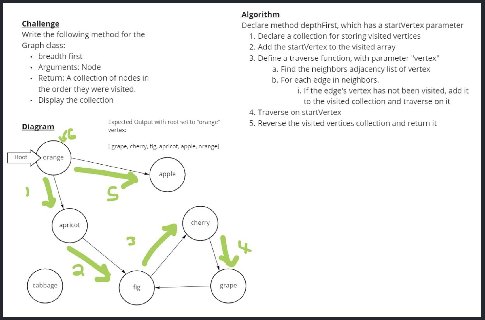

# Graph business trip

## Challenge
Write the following method for the Graph class:

Name: Depth first
Arguments: Node (Starting point of search)
Return: A collection of nodes in their pre-order depth-first traversal order
Program output: Display the collection
Utilize the Single-responsibility principle: any methods you write should be clean, reusable, abstract component parts to the whole challenge. You will be given feedback and marked down if you attempt to define a large, complex algorithm in one function definition.
Write at least three test assertions for each method that you define.
Ensure your tests are passing before you submit your solution.

## Test
to run the test, type in "npm test code-challenge-38"

## Approach & Efficiency
Console logs, bing, stackoverflow, TA's, and classmates.

## UML

## Contributions
Jeffrey Smith
Jordan Yamada
